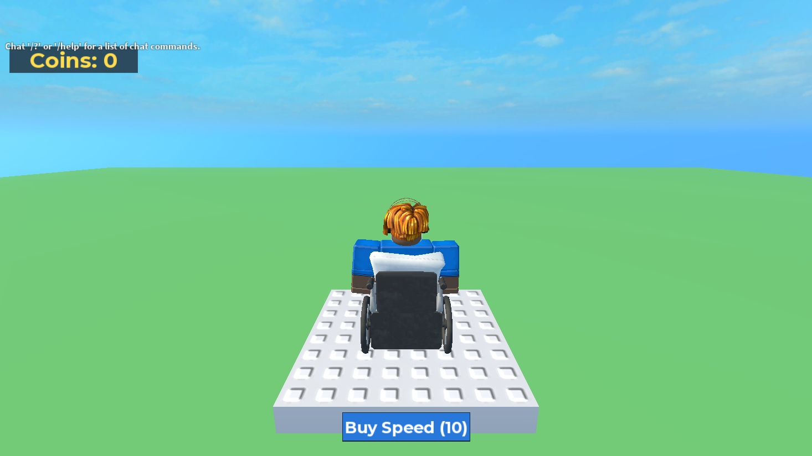
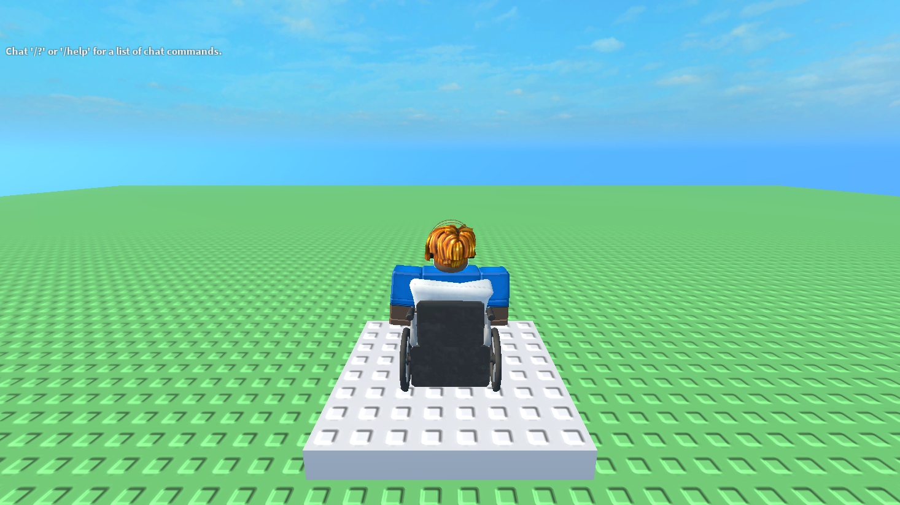
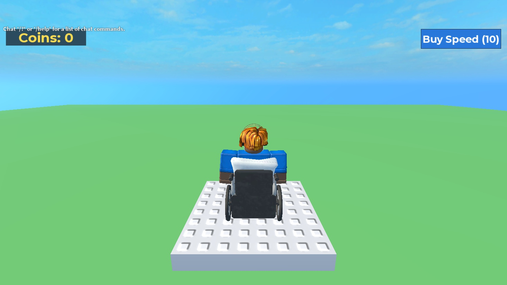

# Plain Claude + Roblox Studio MCP vs Claude + blox (2026-10-05)

The question: does blox beat plain Claude Code connected to Roblox's own Studio MCP?

**Setup:**
- Same model on every side: Opus 5.5, on a subscription (no API charge; costs below are API-equivalent).
- Same Studio build and same night.
- Same 3 tasks: t2 coins (new mechanic), t6 door (runtime debugging), t7 shop (feature in an existing project).
- Same hidden checks, run in a live playtest; the agents never see them.

| side | what it is |
|---|---|
| **plain** | `claude -p` with only Roblox's StudioMCP server. No blox, no files: it works directly in Studio. The task's starting game is pushed into Studio first. Bench agent `claude-code-studio`. |
| **cc+blox** | `claude -p` with the blox MCP server and the blox agent guide (AGENTS.md). Bench agent `claude-code`. |
| **blox runner** | blox's own runner (`blox "<prompt>"`). Bench agent `blox`. |

## Result

| | plain Claude + Studio MCP | Claude Code + blox MCP | blox runner |
|---|---|---|---|
| hidden checks (live) | **17/17** (3/3 tasks) | **17/17** | **17/17** |
| model requests (turns) | 57 | 25 | **20** |
| cost, API-equivalent | $1.69 | $1.18 | **$0.98** |
| wall time | 268 s | 299 s | **233 s** |
| context read (cache) | 2.18M tokens | 0.77M | **0.62M** |
| tool errors | n/a | 3 (all one cause, fixed below) | 0 |
| code lives in | the Studio place only | files + git, synced to Studio | files + git, synced to Studio |
| own tests left behind | none | `tests/*.spec.luau`, re-runnable | `tests/*.spec.luau`, re-runnable |

Per task (turns / cost / time):

| task | plain | cc+blox | blox runner |
|---|---|---|---|
| t2 coins | 15 / $0.46 / 78 s | 6 / $0.35 / 70 s | 5 / $0.39 / 59 s |
| t6 door | 16 / $0.44 / 65 s | 8 / $0.31 / 79 s → **58 s after fix** | 5 / $0.18 / 48 s |
| t7 shop | 26 / $0.78 / 125 s | 11 / $0.52 / 150 s | 10 / $0.42 / 126 s |

## What this says

- **Correctness: a tie on these tasks.** Opus 5.5 with Roblox's current Studio MCP finished all three. Studio MCP now has `multi_edit`, `script_read`, play control, input simulation and console output, so plain Claude can build, play-test and debug on its own. Its t7 run was careful: it clicked the real button with simulated mouse input, found that the chat window was swallowing the clicks, and moved the button.
- **Efficiency: blox needs about 2.5–3× fewer model requests and about 40% less cost.** Plain Claude spends turns looking around: searching the game tree, dumping instances, reading scripts, and making separate play/execute/console calls. blox tools return what the agent needs in one call, for example `run_tests` = sync + play + results. That keeps the context small: 0.6–0.8M cached tokens against 2.2M. On a subscription, that means more work fits into a usage window.
- **Time: about even.** Studio latency dominates the wall time (about 3 s per `execute_luau`).
- **What you're left with: blox wins clearly.** Plain Claude leaves code only in the unsaved Studio place: no files, no git, no tests. blox leaves source files under git and re-runnable spec files, and the synced score (files pushed into a clean Studio) is 17/17. A plain-MCP game can't be reviewed, diffed or re-tested, and closing Studio without saving loses it.
- **Where blox lost:** the Claude Code + blox runs on t6 and t7 were slower than plain, because the agent's own `run_tests` failed 3 times on one cause. That cause is fixed below.

Earlier comparisons, for context: `assistant-vs-blox-t8.md` (Roblox Assistant 14/15 in about 7.5 min with several human approvals; blox 15/15 in 103 s) and `after-claude-code.md` (an older Claude Code + blox run).

## Bugs found and fixed tonight

1. **Hidden checks broke on the user's avatar.** The play-test avatar wears a wheelchair accessory. Accessories load after `CharacterAdded`, and the checks teleported the character before that, so touches were missed. The reference solutions failed t6 and t7 (2/3 and 7/9), and the first plain run (13/16) was void. Fix: checks wait for `HasAppearanceLoaded()`. In t7, the server coin checks and the client shop checks also changed the same Coins value at the same time; the shop checks now wait for a `__BenchCoinsDone` flag. `bench --validate`: all 8 tasks VALID.
2. **The same race hit agents' own tests through blox** (3 failed `run_tests` in cc+blox). Fix: blox's play-test host (`src/testing/playHost.ts`) and the metrics bot host wait (up to 10 s) for the avatar's appearance before running specs. Re-running cc+blox on t6: 0 errors, 3 calls instead of 5, 58 s instead of 79 s.
3. **The bench now saves a screenshot per run**: a play-mode viewport capture 5 s in, at `bench/runs/<label>/<task>-1.jpg`.

## Screenshots

- **t2 shots:** edit mode, taken right after each run (the coin layouts).
- **t6/t7 shots:** play mode. These games build their world at runtime, so edit mode shows nothing. The blox shots were recreated from the agents' files.
- **Plain Claude t6/t7:** its games existed only in the Studio place, which the next task reset, so they can't be recreated. The harness now captures in play mode after every run.

| | t2 coins | t6 door | t7 shop |
|---|---|---|---|
| plain |  | — | — |
| cc+blox |  |  |  |
| blox runner |  |  |  |

## Limits

- n=1 per task, with 3 small tasks (each about 1–2 minutes of agent work).
- On bigger builds, the turn and context gap and the files/tests gap should grow. That is not measured here. t8 (pet hatch, 15 checks) would be the next one to run.
- Raw results: `cc-studio-plain-opus55-v2.*`, `cc-blox-opus55-v2.*`, `blox-runner-opus55-v2.*`, `cc-blox-opus55-v3-t6.*`.
