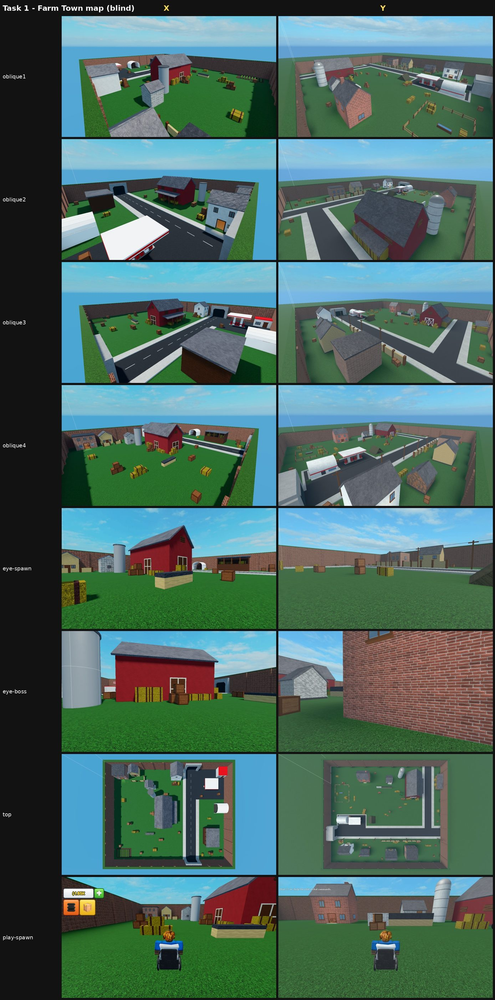
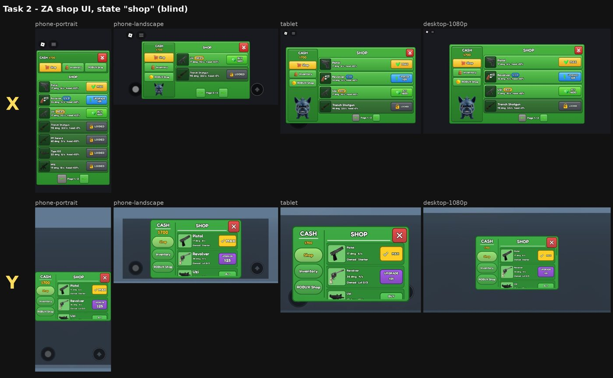

# Quality bake-off: blox vs the article workflow (2026-10-07)

The question: is blox worth continuing, judged on **the quality of the work produced**? The 2026-10-05
comparison (`claude-vs-blox-2026-10-05.md`) only measured pass/fail, turns and cost. This one was judged
blind by the user, on real Dog Attack work.

**Result: blox (B) won both tasks in the user's blind pick.** Under the decision rule in the handoff
(`docs/handoff/2026-10-07-bakeoff.md`), blox continues, and the article workflow's winning practices are
ported into it (list below).

## Setup

| | arm A: the article workflow | arm B: blox |
|---|---|---|
| agent | `claude -p`, Opus 5.5, subscription | same |
| MCP servers | official Studio MCP + [robloxstudio-mcp](https://github.com/Chrrxs/robloxstudio-mcp) 3.1.6 | official Studio MCP + blox MCP |
| instructions | `arm-a-CLAUDE.md`: Rojo files, the 4 checks on an empty project first, one config folder, one remotes file, `TRAPS.md`, spec → preview → UI with the depth stack and a 4-size checker, AI icons (Kaggle / Cloudflare Flux), Hunyuan3D + Blender, map movement checks | blox `AGENTS.md` as shipped (`blox new` + `blox setup claude`) |
| place | `BakeoffA.rbxl`, fresh | `BakeoffB.rbxl`, fresh |

- **Same for both:** the task briefs (`quality-bakeoff-2026-10-07/{common,map,ui}.md`), the references
  (`~/blox-research/zombie-attack`), the inventory packs, upload rights, and a naming contract so one neutral
  script could find the map parts and drive every UI state.
- **One place open at a time.** Runner: `quality-bakeoff-2026-10-07/run-arm.sh`.
- **The two tasks:**
  - **Map:** Zombie Attack's Farm Town.
  - **UI:** ZA's Menu window with the Shop tab, the confirm dialog, the HUD buttons, and phone through 1080p.

## Blind judging

- **Capture:** `judge.py` drove robloxstudio-mcp's HTTP bridge for both places in the same way: the same
  cameras (framed on each map's reachable area), the same device presets (iPhone 14 portrait and landscape,
  iPad, 1080p) and the same backdrop. The judge is not part of either arm's own tooling.
- **Labels:** a coin flip set X = A and Y = B. The key was revealed only after the user picked.

| task | user's pick | user's words (summarised) |
|---|---|---|
| Farm Town map | **Y = blox** | Y's buildings form a more cohesive layout and use the space better, with less empty field. X has the more vibrant palette, which may appeal more to young Roblox players. |
| Shop UI | **Y = blox** | Neither is great. Y's layout is simple and effective; X's layout is confusing (a random angry dog bottom-left, an odd X on the cancel button). X's **button and tile style is better**: Y would improve with X's buttons instead of pills. |

Sheets: [map](quality-bakeoff-2026-10-07/sheet-map.jpg) ·
[shop](quality-bakeoff-2026-10-07/sheet-ui-shop.jpg) ·
[confirm](quality-bakeoff-2026-10-07/sheet-ui-confirm.jpg) ·
[can't afford](quality-bakeoff-2026-10-07/sheet-ui-shop-broke.jpg) ·
[HUD](quality-bakeoff-2026-10-07/sheet-ui-hud.jpg) ·
[inventory](quality-bakeoff-2026-10-07/sheet-ui-inventory.jpg) ·
[ROBUX](quality-bakeoff-2026-10-07/sheet-ui-robux.jpg)

## Objective checks (same scripts for both)

### Map
`map_metrics.luau` builds a raycast grid (2 studs), keeping a point only where a 1.2 × 4.3-stud standing
volume is free. Moves are a walk, a jump of up to 7.2 studs, or a drop of any height, and a sideways ray must
be clear. The search runs forward from the player spawns, and backward to them.

| | A (article) | B (blox) |
|---|---|---|
| play area (reachable bbox) | 216 × 176 studs | 316 × 276 studs |
| parts | 672 (0 mesh, 0 unions) | 845 (0 mesh, 0 unions) |
| distinct BrickColors | 29 | 38 |
| reachable standing points | 10,566 | 23,393 |
| dog spawns that reach the player spawn | 8 / 8 | 8 / 8 |
| boss spawn reachable | yes | yes |
| pockets with no way back | 0 | 0 |
| reachable points more than 7.7 studs above ground | 20 (a raised floor at y=8) | 279 (y=8 surfaces, e.g. shed stairs) |
| reachable points with a roof overhead | 834 | 990 |
| floating parts | 0 | 1 (hay wagon tongue) |
| client triangles / draw calls (spawn view) | 5,912 / 21 | 226,374 / 142 |
| server Heartbeat with 40 walking R15 dummies | 16.67 ms (worst 20.1) | 16.66 ms (worst 20.2) |
| client frame | 16.66 ms (worst 19.1) | 16.66 ms (worst 19.7) |
| script errors in play | 0 | 0 |

- **Frame time:** both sides sit at the 60 fps cap in Studio, so neither shows a cost there.
- **Triangles:** B's count is about 38× A's, from cylinders (silo, poles) and its larger built area. That
  is worth watching on phones.

### UI
`ui_metrics.luau` ran at each device size and state. It checks tap targets of at least 44 px, text of at
least 11 px, elements off-screen, and buttons that overlap.

| | A | B |
|---|---|---|
| small tap targets / tiny text (24 shots) | 0 / 0 | 0 / 0 |
| off-screen elements | 0 (A pages its list) | only scroll-list rows below the fold (clipped, not defects) |
| overlapping buttons | only behind the modal dialog | only behind the modal dialog |
| icons | 25 FLUX.1-schnell images from a Kaggle GPU batch job, backgrounds removed, uploaded | 12 gun pictures + button icons drawn in code (`art/mkicons.py`), one sheet, uploaded |
| depth stack (shadow, gradient, lift, outline) | yes, on every panel and button | no (flat pills) |

### Code quality

| | A | B |
|---|---|---|
| source of truth | Rojo files. Map generated from config by Lune (`tools/build.luau`). | blox files: `world/FarmTown.luau` builder, `src/**`, synced by blox. |
| rebuildable from disk | **verified**: `./check.sh` + `rojo build` rebuilt the place, which was used for the final map shots | blox sync reports "Studio matches files". A full fresh-place rebuild was not run. |
| tests | Lune (no Studio): geometry, map, movement, shop, UI layout at 6 sizes × ~340 states; plus in-Studio `MapCheck` and `ui_sweep` | blox specs: 14 for the map (contract, roofs, pathfinding reach) + 27 for the UI (rules, layout, contract in play, occlusion) |
| config in one place | `src/shared/Config/` (Map, Palette, Player, Lighting, Checks) | `MapSettings.luau`, `GunConfig.luau` |
| traps list | `TRAPS.md` | none (the blox guide covers known traps) |
| lines written (luau/py/md/sh) | ~7,500 | ~3,800 |

## Cost, turns, time (API-equivalent cost on subscription)

| run | turns | cost | wall |
|---|---|---|---|
| A map | 136 | $7.90 | 26 min |
| B map | 67 | $3.83 | 14 min |
| A UI | 153 | $9.61 | 23 min (stopped by the usage limit once, resumed) |
| B UI | 204 | $12.55 | 146 min* |

\* While B-ui ran, the PC was locked overnight, and a locked Windows session stops Studio from entering
Play. B spent about 45 minutes polling for Play, then hit the usage limit. It was resumed after unlock and
finished in 6 minutes. Its turns and cost include that waiting. A ran its UI task while the PC was unlocked.

## Decision

The decision rule says that if A matches or beats B on quality in both tasks, blox stops. **B won both, so
blox continues.** It wins on composition and layout judgement, which comes from its loop (task criteria,
screenshot comparisons against the references, specs), and on the map it took half the cost.

The article workflow still won specific things. These go on the blox gap list:

1. **Workflow: UI depth stack.** The user preferred A's button and tile style (blue-shifted shadow, face
   gradient, top lift, even outline) over B's flat pills. Make it the default look of BloxUI / `ui install`,
   and teach it in the ui-packs skill.
2. **Tooling: AI icon generation.** A got real illustrated gun icons (it used FLUX schnell on Kaggle); B drew
   them in code. Add `blox image generate` feeding `asset sheet`. The user chose Qwen-Image-2.1 on Kaggle as
   the default (see `docs/handoff/2026-10-08-ui-map-refine.md`), with Cloudflare FLUX as the fallback.
3. **Workflow: palette guidance for maps.** The user noted A's saturated palette suits young players. Add
   a "bright, saturated, kid-readable" default to the map guidance and checks.
4. **Tooling: map movement checker.** A wrote a raycast + jump-height MapCheck, and this bake-off's
   `map_metrics.luau` does the same neutrally. blox has only pathfinding specs written per game. Ship
   `blox map check` (reachability, pockets, roofs, floating parts, high ground).
5. **Workflow: pure-rule tests without Studio.** A ran shop and layout rules under Lune across ~340 states in
   seconds. blox edit-context specs need Studio. Consider a Lune runner for `@context pure`.
6. **Watch: triangle budget.** B's map drew about 38× A's triangles. Add a triangle/draw-call budget to
   `blox check` or the release gates.
7. **Workflow: avoid odd mascot filler.** A's UI got marked down for decoration that wasn't asked for
   (the dog). blox's UI guidance should say "no decoration that isn't in the references".

## Limits

- n = 1 per task per arm, judged by one person. Neither UI was rated "great".
- **Different conditions:** A was stopped by the usage limit once. B lost about 45 minutes to the locked PC.
  Neither affected the final quality judged.
- **Judge bugs fixed during the run, before anything was compared:**
  - Standing points inside walls were counted as walkable (fixed with an overlap probe).
  - Device sizes didn't apply (switched to device presets).
  - A's first final recapture came out blank because the Studio window was minimised. The window is now
    restored before every capture, and A's place was rebuilt from its own files for the map shots.
- **Hunyuan3D was not used:** A built everything from parts, as its instructions allow for hard-edged props.
  Generated 3D was not exercised.
- Raw logs and the full judge output are in `~/bakeoff/` on the dev machine (not committed).
